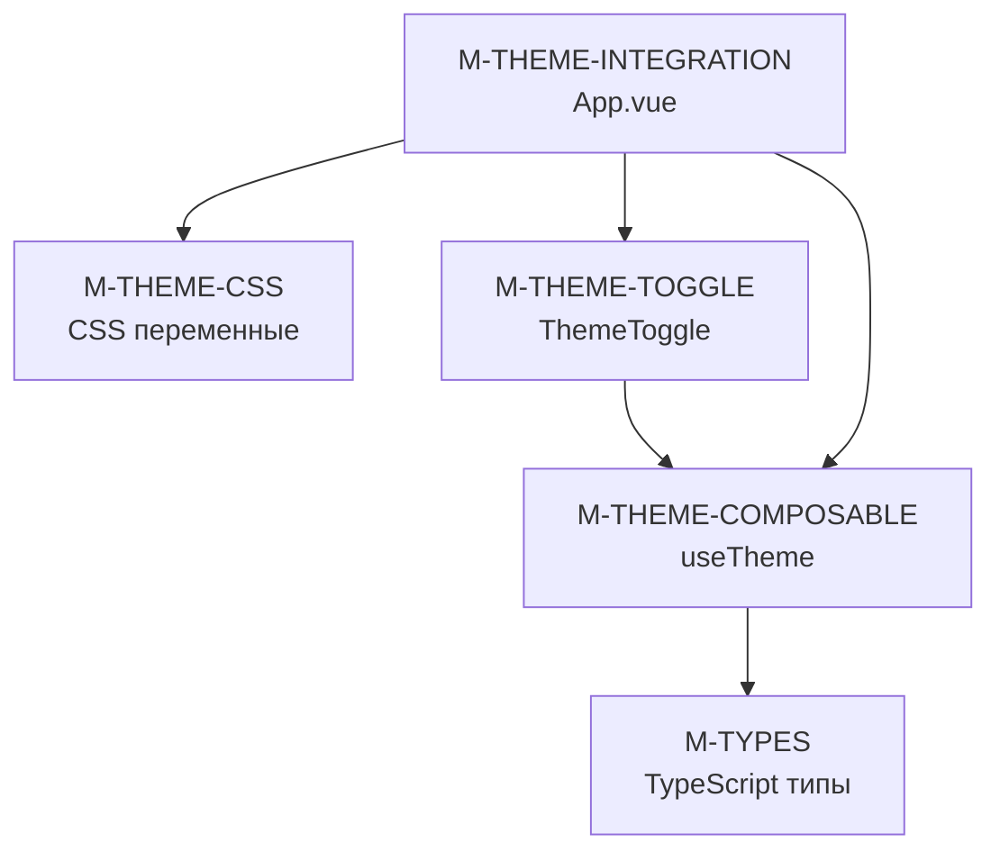
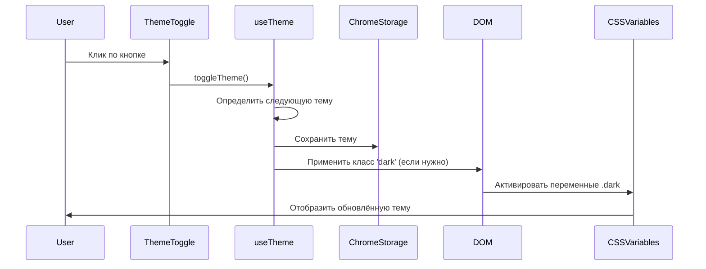

# Архитектурный план тёмной темы для PDF Compressor Extension

## Обзор
Документ описывает архитектуру и контракты для реализации полнофункциональной тёмной темы в соответствии с GRACE методологией.

## Новые модули

### M-THEME-CSS — CSS переменные для тем

**Файл:** `entrypoints/sidepanel/style.css`

**Тип:** UTILITY  
**Слой:** 0 (нет зависимостей)

**Контракт модуля:**
```
// FILE: entrypoints/sidepanel/style.css
// VERSION: 1.0.0
// START_MODULE_CONTRACT
//   PURPOSE: Определение CSS переменных для светлой и тёмной темы
//   SCOPE: Цветовые токены HSL для всех UI элементов
//   DEPENDS: none
//   LINKS: M-THEME-COMPOSABLE, M-THEME-INTEGRATION
// END_MODULE_CONTRACT
//
// START_MODULE_MAP
//   :root — CSS переменные светлой темы по умолчанию
//   .dark — CSS переменные тёмной темы
//   @layer base — Базовые стили Tailwind
// END_MODULE_MAP
```

**Интерфейс:**
```css
/* Светлая тема (по умолчанию) */
:root {
  --background: 0 0% 100%;
  --foreground: 222.2 84% 4.9%;
  --card: 0 0% 100%;
  --card-foreground: 222.2 84% 4.9%;
  --popover: 0 0% 100%;
  --popover-foreground: 222.2 84% 4.9%;
  --primary: 221.2 83.2% 53.3%;
  --primary-foreground: 210 40% 98%;
  --secondary: 210 40% 96.1%;
  --secondary-foreground: 222.2 47.4% 11.2%;
  --muted: 210 40% 96.1%;
  --muted-foreground: 215.4 16.3% 46.9%;
  --accent: 210 40% 96.1%;
  --accent-foreground: 222.2 47.4% 11.2%;
  --destructive: 0 84.2% 60.2%;
  --destructive-foreground: 210 40% 98%;
  --border: 214.3 31.8% 91.4%;
  --input: 214.3 31.8% 91.4%;
  --ring: 221.2 83.2% 53.3%;
  --radius: 0.5rem;
}

/* Тёмная тема */
.dark {
  --background: 222.2 84% 4.9%;
  --foreground: 210 40% 98%;
  --card: 222.2 84% 4.9%;
  --card-foreground: 210 40% 98%;
  --popover: 222.2 84% 4.9%;
  --popover-foreground: 210 40% 98%;
  --primary: 217.2 91.2% 59.8%;
  --primary-foreground: 222.2 47.4% 11.2%;
  --secondary: 217.2 32.6% 17.5%;
  --secondary-foreground: 210 40% 98%;
  --muted: 217.2 32.6% 17.5%;
  --muted-foreground: 215 20.2% 65.1%;
  --accent: 217.2 32.6% 17.5%;
  --accent-foreground: 210 40% 98%;
  --destructive: 0 62.8% 30.6%;
  --destructive-foreground: 210 40% 98%;
  --border: 217.2 32.6% 17.5%;
  --input: 217.2 32.6% 17.5%;
  --ring: 224.3 76.3% 48%;
}
```

---

### M-THEME-COMPOSABLE — Composable для управления темой

**Файл:** `src/components/composables/useTheme.ts`

**Тип:** UTILITY  
**Слой:** 1 (зависит от M-TYPES)

**Контракт модуля:**
```
// FILE: src/components/composables/useTheme.ts
// VERSION: 1.0.0
// START_MODULE_CONTRACT
//   PURPOSE: Реактивное управление темой приложения с сохранением в chrome.storage
//   SCOPE: Инициализация темы, применение класса, сохранение, прослушивание системных предпочтений
//   DEPENDS: M-TYPES, Vue 3 Composition API, Chrome Storage API
//   LINKS: M-THEME-TOGGLE, M-THEME-INTEGRATION
// END_MODULE_CONTRACT
//
// START_MODULE_MAP
//   useTheme — Основной composable для управления темой
//   theme — Ref с текущей темой (light | dark | system)
//   resolvedTheme — Ref с фактической применяемой темой (light | dark)
//   isDark — Ref с boolean состоянием тёмной темы
//   setTheme — Функция для установки темы
//   toggleTheme — Функция для циклического переключения темы
// END_MODULE_MAP
```

**Интерфейс:**
```typescript
interface UseThemeReturn {
  theme: Ref<'light' | 'dark' | 'system'>
  resolvedTheme: Ref<'light' | 'dark'>
  isDark: Ref<boolean>
  setTheme: (theme: 'light' | 'dark' | 'system') => void
  toggleTheme: () => void
}

function useTheme(): UseThemeReturn
```

**Функции:**

```typescript
// START_CONTRACT: useTheme
//   PURPOSE: Создаёт реактивное состояние темы и управляет её применением
//   INPUTS: { none }
//   OUTPUTS: { UseThemeReturn — объект с реактивным состоянием темы и методами управления }
//   SIDE_EFFECTS: Читает/записывает в chrome.storage.local, применяет класс 'dark' к DOM
//   LINKS: M-THEME-CSS, M-THEME-TOGGLE
// END_CONTRACT: useTheme

// START_CONTRACT: setTheme
//   PURPOSE: Устанавливает указанную тему и сохраняет её в хранилище
//   INPUTS: { theme: 'light' | 'dark' | 'system' — тема для установки }
//   OUTPUTS: { void }
//   SIDE_EFFECTS: Сохраняет тему в chrome.storage.local, обновляет DOM
//   LINKS: M-THEME-CSS
// END_CONTRACT: setTheme

// START_CONTRACT: toggleTheme
//   PURPOSE: Циклически переключает тему: light → dark → system → light
//   INPUTS: { none }
//   OUTPUTS: { void }
//   SIDE_EFFECTS: Вызывает setTheme с следующей темой в цикле
//   LINKS: M-THEME-TOGGLE
// END_CONTRACT: toggleTheme
```

---

### M-THEME-TOGGLE — Компонент переключения темы

**Файл:** `src/components/ThemeToggle.vue`

**Тип:** UI_COMPONENT  
**Слой:** 2 (зависит от M-THEME-COMPOSABLE)

**Контракт модуля:**
```
// FILE: src/components/ThemeToggle.vue
// VERSION: 1.0.0
// START_MODULE_CONTRACT
//   PURPOSE: UI компонент для переключения темы с тремя состояниями
//   SCOPE: Визуализация текущей темы, обработка кликов, иконки
//   DEPENDS: M-THEME-COMPOSABLE, Vue 3 Composition API
//   LINKS: M-THEME-INTEGRATION
// END_MODULE_CONTRACT
//
// START_MODULE_MAP
//   ThemeToggle — Главный компонент переключения темы
//   SunIcon — Иконка солнца для светлой темы
//   MoonIcon — Иконка луны для тёмной темы
//   SystemIcon — Иконка полукруга для системного режима
// END_MODULE_MAP
```

**Интерфейс:**
```vue
<template>
  <button
    @click="toggleTheme"
    :aria-label="`Switch to ${nextTheme} theme`"
    class="theme-toggle-button"
  >
    <SunIcon v-if="theme === 'light'" />
    <MoonIcon v-else-if="theme === 'dark'" />
    <SystemIcon v-else />
  </button>
</template>
```

**Компоненты:**

```typescript
// START_CONTRACT: ThemeToggle
//   PURPOSE: Компонент для переключения темы с визуальной обратной связью
//   INPUTS: { none }
//   OUTPUTS: { VNode — отрисованный компонент кнопки }
//   SIDE_EFFECTS: Вызывает toggleTheme из useTheme при клике
//   LINKS: M-THEME-COMPOSABLE
// END_CONTRACT: ThemeToggle
```

---

### M-THEME-INTEGRATION — Интеграция темы в App.vue

**Файл:** `entrypoints/sidepanel/App.vue` (обновление существующего)

**Тип:** INTEGRATION  
**Слой:** 3 (зависит от M-THEME-COMPOSABLE, M-THEME-TOGGLE)

**Контракт модуля:**
```
// FILE: entrypoints/sidepanel/App.vue
// VERSION: 2.0.0
// START_MODULE_CONTRACT
//   PURPOSE: Интеграция системы тем в основное приложение
//   SCOPE: Применение класса темы, добавление компонента ThemeToggle, обновление цветовых классов
//   DEPENDS: M-THEME-COMPOSABLE, M-THEME-TOGGLE, M-SIDEPANEL
//   LINKS: M-THEME-CSS
// END_MODULE_CONTRACT
//
// START_MODULE_MAP
//   App — Главный компонент приложения с поддержкой темы
//   useTheme — Использование composable для управления темой
//   ThemeToggle — Компонент переключения темы в заголовке
// END_MODULE_MAP
```

**Изменения:**

```vue
<template>
  <div :class="{ 'dark': isDark }" class="min-h-screen bg-background text-foreground p-3">
    <div class="w-full">
      <div class="flex items-center justify-between mb-4">
        <h1 class="text-xl font-bold text-foreground">PDF Compressor</h1>
        <ThemeToggle />
      </div>
      <!-- Остальной контент с семантическими цветовыми классами -->
    </div>
  </div>
</template>
```

---

## Зависимости модулей



## Поток данных темы



## Обновления в существующих артефактах GRACE

### 1. docs/development-plan.xml

Добавить новые модули в секцию `<Modules>`:

```xml
<!-- Layer 0 - No dependencies -->
<M-THEME-CSS NAME="ThemeCSS" TYPE="UTILITY" LAYER="0" ORDER="7">
  <contract>
    <purpose>CSS переменные для светлой и тёмной темы</purpose>
    <inputs>
      <param name="none" type="none" />
    </inputs>
    <outputs>
      <param name="cssVariables" type="CSS custom properties" />
    </outputs>
  </contract>
  <interface>
    <export-root PURPOSE="CSS переменные светлой темы" />
    <export-dark PURPOSE="CSS переменные тёмной темы" />
  </interface>
  <depends>none</depends>
</M-THEME-CSS>

<!-- Layer 1 - Depends on Layer 0 -->
<M-THEME-COMPOSABLE NAME="ThemeComposable" TYPE="UTILITY" LAYER="1" ORDER="4">
  <contract>
    <purpose>Реактивное управление темой с сохранением в chrome.storage</purpose>
    <inputs>
      <param name="none" type="none" />
    </inputs>
    <outputs>
      <param name="theme" type="Ref of theme state" />
      <param name="setTheme" type="Function to set theme" />
      <param name="toggleTheme" type="Function to cycle theme" />
    </outputs>
  </contract>
  <interface>
    <export-useTheme PURPOSE="Main composable for theme management" />
    <export-theme PURPOSE="Current theme ref" />
    <export-resolvedTheme PURPOSE="Actual applied theme ref" />
    <export-isDark PURPOSE="Boolean dark mode ref" />
    <export-setTheme PURPOSE="Set theme function" />
    <export-toggleTheme PURPOSE="Cycle theme function" />
  </interface>
  <depends>M-TYPES</depends>
</M-THEME-COMPOSABLE>

<!-- Layer 2 - Depends on Layer 1 -->
<M-THEME-TOGGLE NAME="ThemeToggle" TYPE="UI_COMPONENT" LAYER="2" ORDER="3">
  <contract>
    <purpose>UI компонент для переключения темы с тремя состояниями</purpose>
    <inputs>
      <param name="click" type="Event" />
    </inputs>
    <outputs>
      <param name="themeChange" type="Event to toggle theme" />
    </outputs>
  </contract>
  <interface>
    <export-default PURPOSE="Theme toggle button component" />
    <export-SunIcon PURPOSE="Sun icon for light theme" />
    <export-MoonIcon PURPOSE="Moon icon for dark theme" />
    <export-SystemIcon PURPOSE="System icon for auto theme" />
  </interface>
  <depends>M-THEME-COMPOSABLE</depends>
</M-THEME-TOGGLE>

<!-- Layer 3 - Integration -->
<M-THEME-INTEGRATION NAME="ThemeIntegration" TYPE="INTEGRATION" LAYER="3" ORDER="2">
  <contract>
    <purpose>Интеграция системы тем в основное приложение</purpose>
    <inputs>
      <param name="theme" type="Ref of theme state" />
    </inputs>
    <outputs>
      <param name="themedUI" type="VNode with theme applied" />
    </outputs>
  </contract>
  <interface>
    <export-App PURPOSE="Main app component with theme support" />
  </interface>
  <depends>M-THEME-COMPOSABLE, M-THEME-TOGGLE, M-THEME-CSS</depends>
</M-THEME-INTEGRATION>
```

Обновить секцию `<ImplementationOrder>`:

```xml
<!-- Phase 5: Dark Theme - New phase -->
<Phase-5 name="Dark Theme" status="pending">
  <step-1 module="M-THEME-CSS">CSS переменные для тем</step-1>
  <step-2 module="M-THEME-COMPOSABLE">useTheme composable</step-2>
  <step-3 module="M-THEME-TOGGLE">ThemeToggle компонент</step-3>
  <step-4 module="M-THEME-INTEGRATION">Интеграция в App.vue</step-4>
  <step-5 module="M-THEME-INTEGRATION">Обновление цветовых классов в компонентах</step-5>
</Phase-5>
```

### 2. docs/knowledge-graph.xml

Добавить новые модули:

```xml
<!-- Theme System -->
<M-THEME-CSS NAME="ThemeCSS" TYPE="UTILITY">
  <purpose>CSS переменные для светлой и тёмной темы</purpose>
  <path>entrypoints/sidepanel/style.css</path>
  <depends>none</depends>
  <annotations>
    <var-root PURPOSE="CSS variables for light theme" />
    <var-dark PURPOSE="CSS variables for dark theme" />
  </annotations>
</M-THEME-CSS>

<M-THEME-COMPOSABLE NAME="ThemeComposable" TYPE="UTILITY">
  <purpose>Реактивное управление темой с сохранением в chrome.storage</purpose>
  <path>src/components/composables/useTheme.ts</path>
  <depends>M-TYPES</depends>
  <annotations>
    <fn-useTheme PURPOSE="Main composable for theme management" />
    <fn-setTheme PURPOSE="Set theme and save to storage" />
    <fn-toggleTheme PURPOSE="Cycle through theme modes" />
  </annotations>
</M-THEME-COMPOSABLE>

<M-THEME-TOGGLE NAME="ThemeToggle" TYPE="UI_COMPONENT">
  <purpose>UI компонент для переключения темы с тремя состояниями</purpose>
  <path>src/components/ThemeToggle.vue</path>
  <depends>M-THEME-COMPOSABLE</depends>
  <annotations>
    <comp-ThemeToggle PURPOSE="Theme toggle button component" />
    <comp-SunIcon PURPOSE="Sun icon for light theme" />
    <comp-MoonIcon PURPOSE="Moon icon for dark theme" />
    <comp-SystemIcon PURPOSE="System icon for auto theme" />
  </annotations>
</M-THEME-TOGGLE>

<M-THEME-INTEGRATION NAME="ThemeIntegration" TYPE="INTEGRATION">
  <purpose>Интеграция системы тем в основное приложение</purpose>
  <path>entrypoints/sidepanel/App.vue</path>
  <depends>M-THEME-COMPOSABLE, M-THEME-TOGGLE, M-THEME-CSS</depends>
  <annotations>
    <fn-App PURPOSE="Main app component with theme support" />
  </annotations>
</M-THEME-INTEGRATION>
```

Добавить CrossLinks:

```xml
<CrossLink from="M-THEME-COMPOSABLE" to="M-TYPES" relation="uses types from" />
<CrossLink from="M-THEME-TOGGLE" to="M-THEME-COMPOSABLE" relation="uses theme state from" />
<CrossLink from="M-THEME-INTEGRATION" to="M-THEME-COMPOSABLE" relation="uses theme management from" />
<CrossLink from="M-THEME-INTEGRATION" to="M-THEME-TOGGLE" relation="contains toggle component" />
<CrossLink from="M-THEME-INTEGRATION" to="M-THEME-CSS" relation="applies CSS variables from" />
<CrossLink from="M-SIDEPANEL" to="M-THEME-INTEGRATION" relation="integrates theme system via" />
```

### 3. docs/requirements.xml

Добавить use cases для темы:

```xml
<!-- Theme requirements -->
<UC-009>
  <Actor>User</Actor>
  <Action>Selects a theme preference</Action>
  <Goal>To customize the appearance of the extension</Goal>
  <AcceptanceCriteria>
    - User can select Light, Dark, or System theme
    - Theme preference is saved in chrome.storage.local
    - Theme preference persists across extension reloads
  </AcceptanceCriteria>
</UC-009>

<UC-010>
  <Actor>System</Actor>
  <Action>Detects system theme preference</Action>
  <Goal>To automatically apply user's system theme</Goal>
  <AcceptanceCriteria>
    - System theme is detected on first load if no preference saved
    - Changes to system theme are reflected when System mode is selected
    - Fallback to Light theme if system preference cannot be determined
  </AcceptanceCriteria>
</UC-010>

<UC-011>
  <Actor>User</Actor>
  <Action>Toggles theme manually</Action>
  <Goal>To quickly switch between theme modes</Goal>
  <AcceptanceCriteria>
    - Clicking toggle button cycles: Light → Dark → System → Light
    - Visual feedback shows current theme with appropriate icon
    - Theme changes smoothly with CSS transitions
  </AcceptanceCriteria>
</UC-011>
```

## Порядок реализации

### Фаза 1: Базовая инфраструктура
1. **M-THEME-CSS** — Добавить CSS переменные для тёмной темы в `style.css`
2. **M-THEME-COMPOSABLE** — Создать composable `useTheme.ts` с интеграцией хранилища
3. **M-THEME-TOGGLE** — Создать компонент `ThemeToggle.vue`
4. **M-THEME-INTEGRATION** — Интегрировать в `App.vue`

### Фаза 2: Обновление компонентов
5. Обновить `App.vue` с семантическими цветовыми классами
6. Обновить `CompressionLevelSelector.vue`
7. Обновить другие UI компоненты с хардкодными цветами

### Фаза 3: Полировка
8. Добавить анимации перехода темы
9. Убедиться, что все UI компоненты поддерживают обе темы
10. Протестировать edge cases

## Валидационный чеклист

- [ ] Все модули имеют уникальные ID (M-THEME-CSS, M-THEME-COMPOSABLE, M-THEME-TOGGLE, M-THEME-INTEGRATION)
- [ ] Все зависимости документированы с CrossLinks
- [ ] Все use cases имеют критерии приёмки
- [ ] Порядок реализации уважает зависимости слоёв
- [ ] Контракты следуют GRACE семантической разметке
- [ ] XML теги используют уникальные имена (не атрибуты ID)
